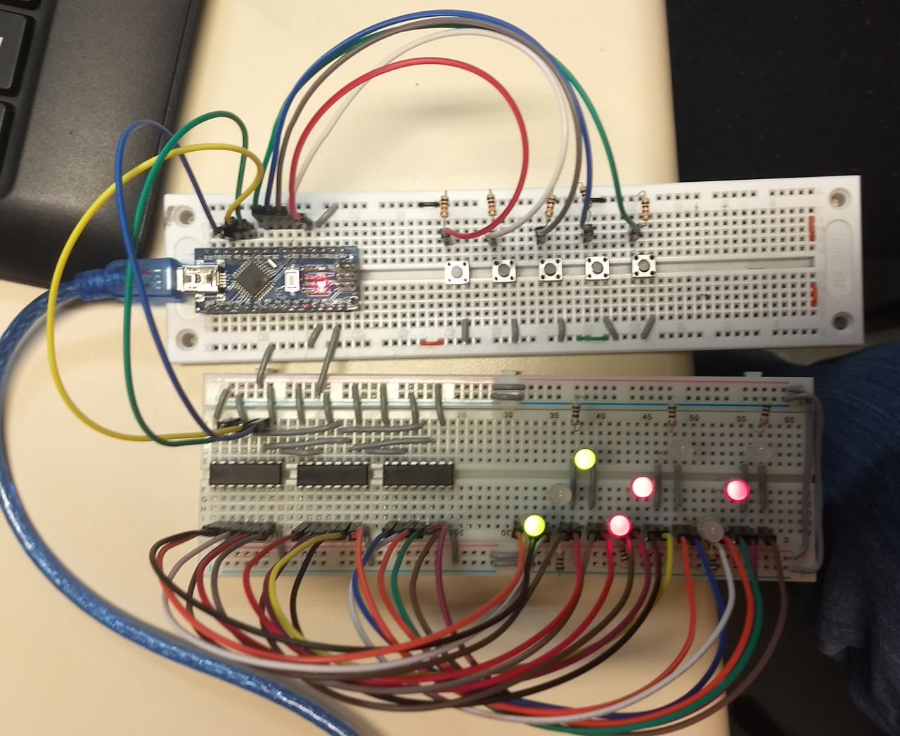
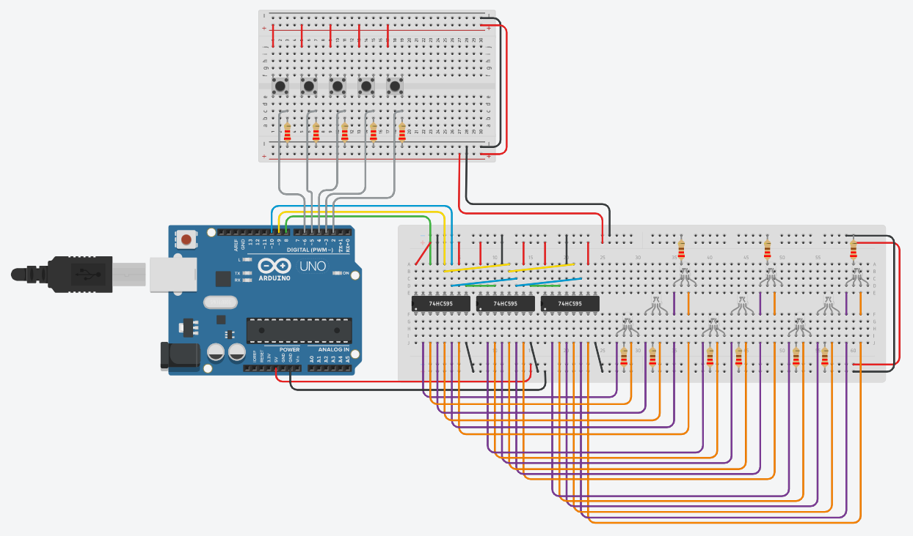

# Jogo da Velha
Projeto em Arduino de um jogo da velha, utilizando leds bicolores e registradores de 8 bits.

Vídeo: https://youtu.be/p1oP6iysT8Q

## Circuito

Tinkercad: https://www.tinkercad.com/things/0NdGDQtXdvq

